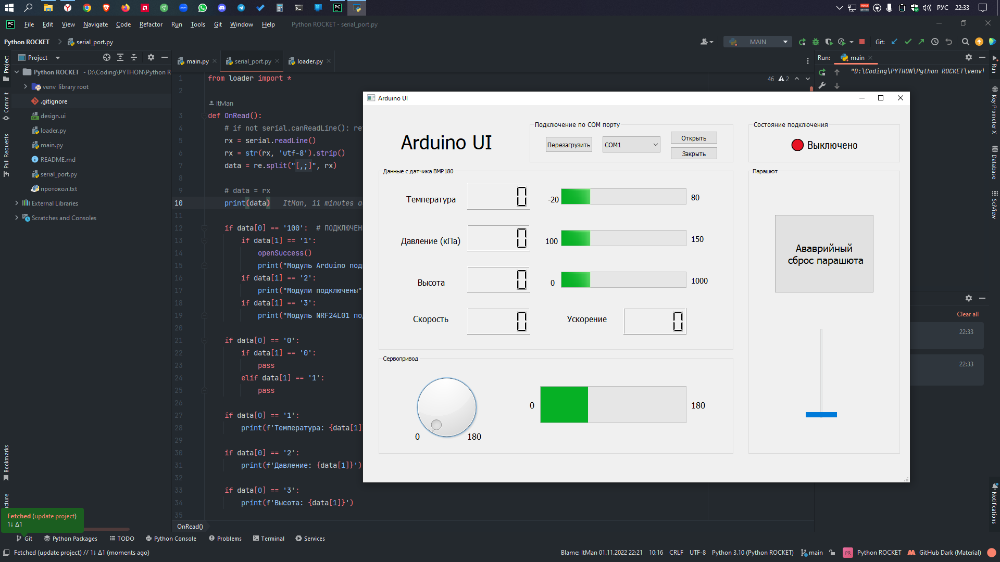

# Python-ROCKET

Что уже сделано сейчас:
1. макет десктопного приложения
2. скелет основного скрипта: 
  а. коннект с SerialPort 
  b. коннект с макетом 
  c. функции по мелочи
  

Что хочу сделать в будущем:
1. общение модулей с приложением:  
  (bmp180 -> температура, давление, высота, 
  mpu6050 -> скорость, ускорение, 
  NRF24L01 -> общение двух ардуино 
  сервопривод итд) 
2. аварийная активация парашюта
3. доработать макет

